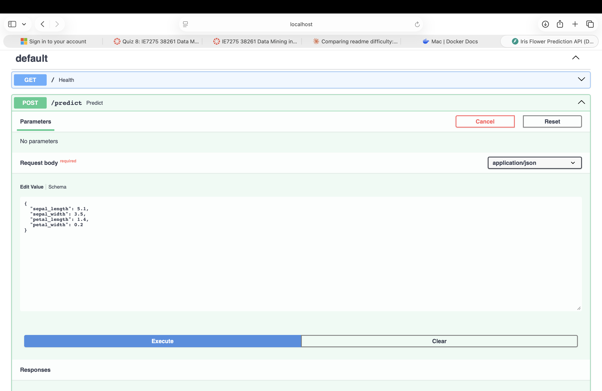
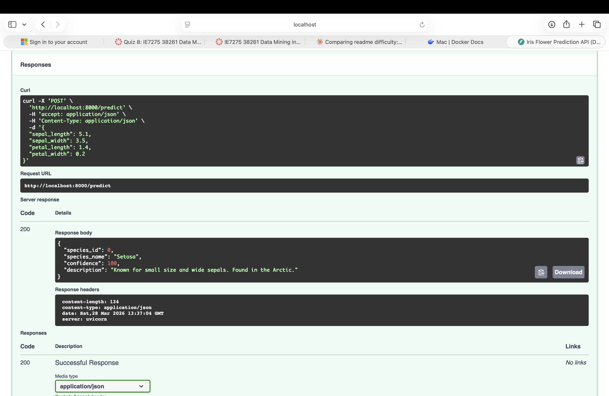

# Docker Lab - Dockerized Iris Prediction API

Hrishikesh Prabhu | IE-7374 MLOps | Spring 2026

## What This Lab Is About

This lab takes the Iris Prediction API I built in my FastAPI lab and packages it into a Docker container. Instead of asking someone to install Python, set up a virtual environment, install dependencies, and train the model — they just run one command and everything works.

## What I Changed From the Original

The original Docker lab just trains a model inside a container and prints "model training successful." I replaced that with my actual FastAPI prediction API running inside Docker, complete with confidence scores, species descriptions, and all four endpoints.

## How It Connects to My Other Labs

- **GitHub Lab 1** — learned CI/CD and testing
- **FastAPI Lab** — built the Iris API with confidence scores and species info
- **MLMD Lab** — tracked that pipeline's metadata
- **This Lab** — containerized the same API so it can run anywhere

## API Running Inside Docker

The Swagger docs page showing all four endpoints:



The predict endpoint returns species name, confidence score, and description — all from inside a Docker container:



## What's Inside the Container

The Docker container packages: Python 3.10, scikit-learn, FastAPI, uvicorn, and the model training code. When the container starts, it trains the Random Forest model automatically and starts serving predictions.

**Endpoints:**
- `GET /` — health check (confirms it's running in Docker)
- `POST /predict` — send flower measurements, get species + confidence
- `GET /model-info` — shows model type, accuracy, running in Docker
- `GET /species` — lists all three Iris species with descriptions

## How to Run It

1. Make sure Docker is installed and running

2. Navigate to the lab
```bash
cd Labs/Docker_Labs/Lab1
```

3. Build the image
```bash
docker build -t iris-api .
```

4. Run the container
```bash
docker run -d -p 8000:8000 --name iris-container iris-api
```

5. Open http://localhost:8000/docs and test the API

6. When done, stop and remove the container
```bash
docker stop iris-container
docker rm iris-container
```

## Dockerfile Explained

```dockerfile
FROM python:3.10-slim       # lightweight Python base image
WORKDIR /app                # set working directory
COPY src/ .                 # copy source code into container
RUN pip install -r requirements.txt  # install dependencies
EXPOSE 8000                 # expose the API port
CMD ["uvicorn", "main:app", "--host", "0.0.0.0", "--port", "8000"]  # start the server
```

## What I Learned

- Docker makes deployment way easier — no more "works on my machine" problems
- The Dockerfile is basically a recipe for building your environment from scratch
- Using `python:3.10-slim` keeps the image small compared to the full version
- The container is completely self-contained — trains the model on startup and serves it
- This is how real ML models get deployed in production — inside containers
