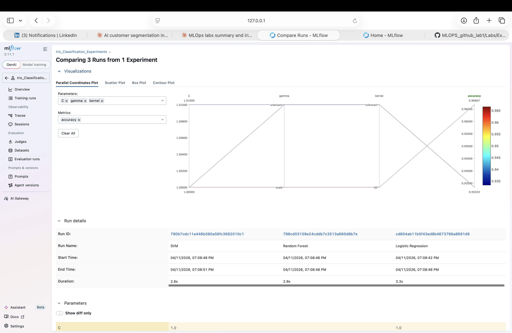
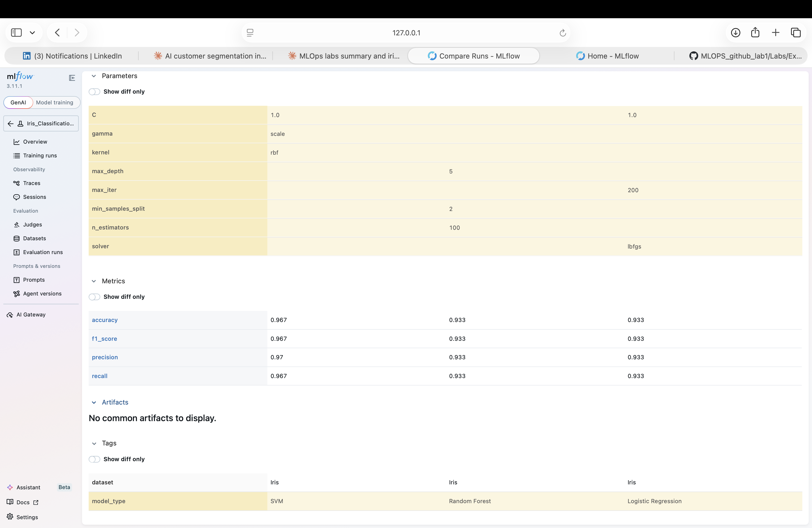

# MLflow Lab — Iris Classification Experiment Tracking

## How It Connects to My Other Labs

This lab adds **experiment tracking** to the same Iris flower prediction pipeline built across all previous labs:

- **Lab 1 (GitHub Actions)** — automated testing for the Iris pipeline
- **Lab 2 (FastAPI)** — served the Random Forest model as a REST API
- **Lab 4 (MLMD)** — tracked metadata and lineage of the Iris pipeline
- **Lab 5 (Docker)** — containerized the FastAPI prediction service
- **This Lab (MLflow)** — tracks and compares multiple model experiments before deciding which model to deploy

MLflow answers the question: *"Which model should go into the FastAPI + Docker pipeline?"*

---

## What This Lab Does

Runs three classification models on the Iris dataset and logs every experiment to MLflow:

| Model | Key Parameters | Accuracy | F1 Score | Precision | Recall |
|---|---|---|---|---|---|
| Logistic Regression | C=1.0, max_iter=200, solver=lbfgs | 0.933 | 0.933 | 0.933 | 0.933 |
| Random Forest | n_estimators=100, max_depth=5 | 0.933 | 0.933 | 0.933 | 0.933 |
| **SVM** | **kernel=rbf, C=1.0, gamma=scale** | **0.967** | **0.967** | **0.970** | **0.967** |

**Winner: SVM with 96.7% accuracy** — consistent with the model used in the FastAPI lab.

Each run logs:
- **Parameters** — hyperparameters used
- **Metrics** — accuracy, F1 score, precision, recall
- **Model artifact** — saved and registered in MLflow Model Registry
- **Tags** — dataset name, model type

---

## MLflow UI Screenshots

### All 3 Training Runs


### Comparing 3 Runs — Parallel Coordinates Plot


### Metrics Comparison


---

## How to Run It

### 1. Install dependencies
```bash
pip install -r requirements.txt
```

### 2. Run experiments
```bash
MLFLOW_TRACKING_URI=sqlite:///mlflow.db python3 iris_experiment.py
```

### 3. Launch MLflow UI
```bash
mlflow ui --backend-store-uri sqlite:///mlflow.db
```

### 4. Open the dashboard
```
http://127.0.0.1:5000
```

Navigate to **Experiments → Iris_Classification_Experiments → Training runs** to see all 3 runs. Select all and click **Compare** to see the side-by-side metrics view.

---

## What the MLflow UI Shows

- **Training runs** — all 3 runs listed with status, duration, and registered models
- **Parallel coordinates plot** — visualizes how parameters map to accuracy across runs
- **Metrics comparison** — accuracy, F1, precision, recall side by side
- **Parameters comparison** — all hyperparameters compared across models
- **Model Registry** — each model registered as `Iris_Logistic_Regression`, `Iris_Random_Forest`, and `Iris_SVM`

---

## Key Takeaway

SVM outperformed both Logistic Regression and Random Forest on the Iris dataset with **96.7% accuracy**. This experiment tracking workflow validates which model deserves to be deployed in the FastAPI + Docker pipeline from the previous labs.